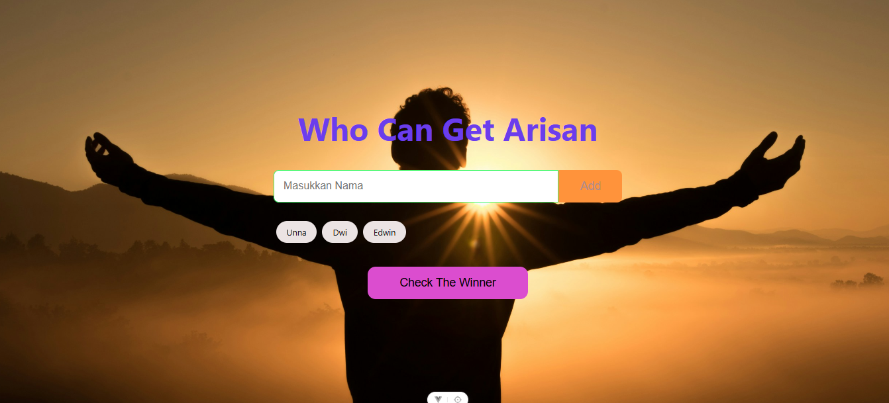

🌐 Live Demo

🔗 https://edwinalfadin.github.io/Project-in-Vue-Basic/

🎉 Aplikasi Arisan Vue.js

Aplikasi Arisan Vue.js adalah aplikasi sederhana untuk mengocok nama peserta secara acak. Dibangun menggunakan Vue.js 3, aplikasi ini cocok digunakan untuk arisan, undian doorprize, pembagian hadiah, maupun sebagai media belajar dasar Vue.js.

---

✨ Fitur

- ➕ Menambahkan nama peserta.
- ❌ Menghapus nama peserta.
- 📋 Menampilkan daftar peserta.
- 🎲 Mengocok nama secara acak.
- 🎉 Animasi pengocokan nama.
- ✅ Nama yang sudah terpilih tidak akan muncul lagi.
- 🔄 Reset undian untuk memulai kembali.

---

🛠️ Teknologi

- HTML5
- CSS3
- JavaScript (ES6)
- Vue.js 3

---

📁 Struktur Project

arisan-vue/
│
├── index.html
├── style.css
├── app.js
└── README.md

---

🚀 Cara Menjalankan

1. Clone repository.

git clone https://github.com/EdwinAlfadin/Project-in-Vue-Basic.git

2. Masuk ke folder project.

cd arisan-vue

3. Buka file "index.html" menggunakan browser.

«Tidak memerlukan proses build atau instalasi karena menggunakan Vue.js melalui CDN.»

---

📸 Tampilan Aplikasi

---

🤝 Kontribusi

Kontribusi, saran, dan perbaikan sangat terbuka. Silakan buat Issue atau Pull Request apabila ingin mengembangkan project ini.

📄 Lisensi

Project ini dibuat untuk tujuan belajar dan bebas digunakan sebagai referensi pengembangan aplikasi Vue.js.

---

Dibuat dengan ❤️ menggunakan Vue.js
